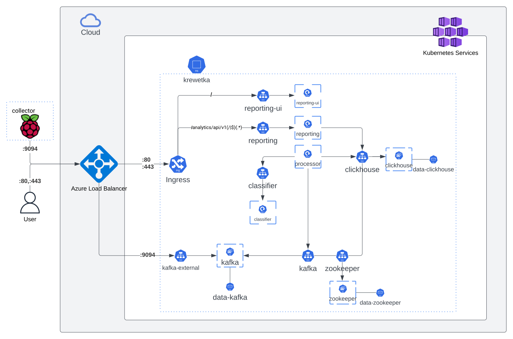

# krewetka

## What's that
This project presents a real-time intrusion detection system based on an artificial intelligence model. The purpose of this system is to detect disturbing or suspicious activities in the computer network and prevent unauthorized access to it.

Machine learning algorithms were used to build the system, which enabled the automatic detection of anomalies in network traffic. Thanks to this, the system is able to learn from historical data and detect new, previously unknown threats.
## Components
### Local agent
application which can be ran on a device like raspberry pi. it relies on external tool called `nprobe`, to be more specific, on the format that the tool exports collected packets in.

* Collector is an agent responsible for receiving data in NetFlow version 9 format from nProbe exporter, which should be set to ZMQ. Captured data is sent with a host identifier to the server in a cloud via Kafka for further processing of the data.

### Remote server
The project as a whole is designed to be deployed on Kubernetes. It kinds of follow microservice architecture, components are decoupled. Nonetheless, some of them use the same database or depends on the other ones. Although, it does not seem to be advanced enough to require different databases.

#### Services
* Processor - the processing service responsible for reading data stream from Kafka topics. Processed data is saved to database.
* Reporting - an API, which queries database to acquire aggregated, transformed data. Consists of HTTP and WebSocket endpoints, which allow to stream the data to clients.
* Classifier - gRPC server that serves to classify NetFlow messages. The outcome can be `malicious` or `non-malicious`.
* Reporting-UI - Component responsible for serving user interface.
* Kafka - serves as a data streaming platform.
* Clickhouse - stores collected and processed data.
* Zookeeper - required for clickhouse and kafka.

#### Others
* grafana, prometheus - observability and monitoring.
* ingress-nginx - ingress controller for Kubernetes.

## Architecture and data flow


## Explanation of the folder structure in the project
### collector
Application for collecting data, detailed information [here](./collector/)
### processor
Application for processing data, detailed information [here](./processor/)

### reporting
Application for creating reports based on collected data, detailed information [here](./reporting/)

### classification
Classification application, detailed information [here](./classification/)

### frontend
User interface application, detailed information [here](./frontend/)

### charts
This catalog includes Helm charts that are necessary to deploy the project. It highly reduced manual tuning of kubernetes templates. In best case scenario it only requires creation of docker registry secret.

Detailed information [here](./charts/)

### deploy
In order to minimize necessity for manual configuration of the servers and services, terraform has been concerned to solve that. Terraform code provisions necessary resources on a Cloud. The project uses Microsoft Azure as a cloud provider.

Detailed information [here](./deploy/)

## Deployment instructions
### Prerequisites
* being logged in to `az cli` - can be installed from [here](https://learn.microsoft.com/en-us/cli/azure/install-azure-cli)
* terraform - can be installed from [here](https://developer.hashicorp.com/terraform/tutorials/aws-get-started/install-cli)
* kubectl - can be installed from [here](https://kubernetes.io/docs/tasks/tools/)
* helm - can be installed from [here](https://helm.sh/docs/intro/install/)

### Provision infrastructure
1. `cd deploy`
2. Initialize terraform modules

```bash
terraform init
```

3. Create infrastructure, it requires manual input of `yes` after checking resources that are planned to be creates.

```bash
terraform apply
```
4. Ensure that the previous command exited successfully
5. Export public IP address of the Azure Load Balancer
```bash
export PUBLIC_IP=$(terraform output -raw publicip)
```
6. Add kubeconfig
```bash
terraform output -raw kubeconfig >> ${HOME}/.kube/config
```

### Deploy helm chart to kubernetes
1. `cd ../chart`

2. Download dependecy charts with command below, it should create few `.tgz` archives in `./charts` directory
```bash
helm dependency update
```

3. Install helm chart
```bash
helm install <release-name> . -f values.yaml --namespace krewetka --create-namespace --set ingress-nginx.controller.service.loadBalancerIP=$PUBLIC_IP --set kafka.externalAccess.service.loadBalancerIPs={$PUBLIC_IP}
```

4. Inspect k8s cluster, check whether all pods and services are running(in a green state)
