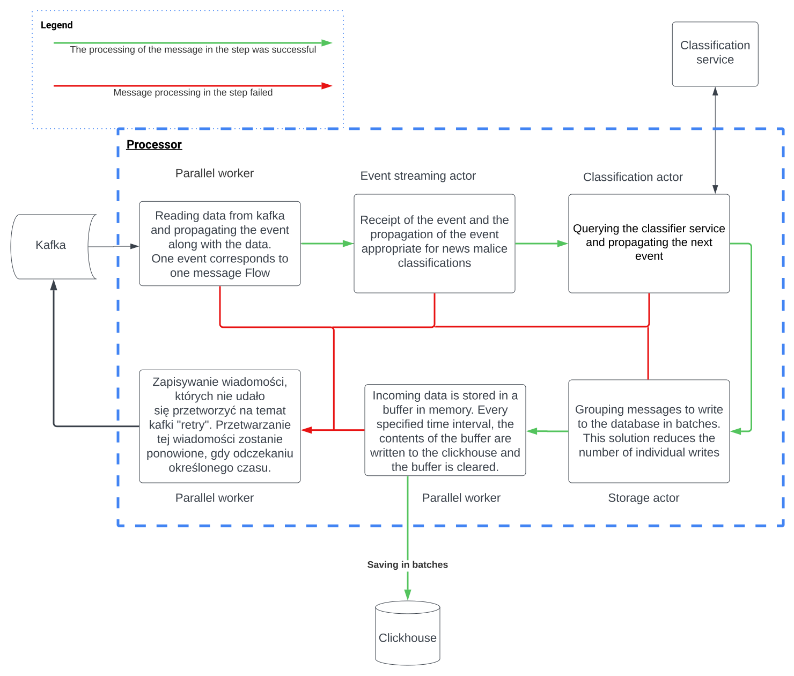

# processor
This application is a worker that reads data from Kafka. It is designed to work in a container. It relies on data streaming platform - **Kafka** and database - **Clickhouse**

Processor is written in **Rust**.

It has two binaries:
* processor itself
* database migrator, which applies database schema migrations

## What is it responsible for
* reading data from kafka asynchronously
* labeling the data with proper values
* transforming the data
* requesting classification service for the class result
* batching messages 
* saving messages in batches in clickhouse asynchronously

## Data flow



## Configuration

### Processor
Requires exporting environment variables with following names

```bash
KREWETKA__KAFKA_BROKERS: <kafka-brokers>
KREWETKA__KAFKA_TOPIC: <kafka-topic>
KREWETKA__CLICKHOUSE_SETTINGS__HOST: <clickhouse-host>
KREWETKA__CLICKHOUSE_SETTINGS__PORT: <clickhouse-port>
KREWETKA__CLICKHOUSE_SETTINGS__USER: <clickhouse-user>
KREWETKA__CLICKHOUSE_SETTINGS__PASSWORD: <clickhouse-user-password> 
KREWETKA__GRPC_CLASSIFICATION_HOST: <classifier-grpc-host>
KREWETKA__GRPC_CLASSIFICATION_PORT: <classifier-grpc-port>
```

### Migrator
Requires exporting environment variables with following names

```bash
KREWETKA__CLICKHOUSE_SETTINGS__HOST: <clickhouse-host>
KREWETKA__CLICKHOUSE_SETTINGS__PORT: <clickhouse-port>
KREWETKA__CLICKHOUSE_SETTINGS__USER: <clickhouse-user>
KREWETKA__CLICKHOUSE_SETTINGS__PASSWORD: <clickhouse-user-password> 
```